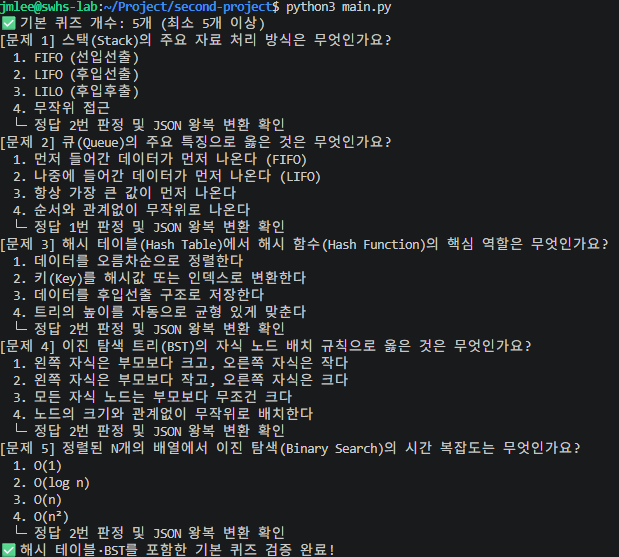
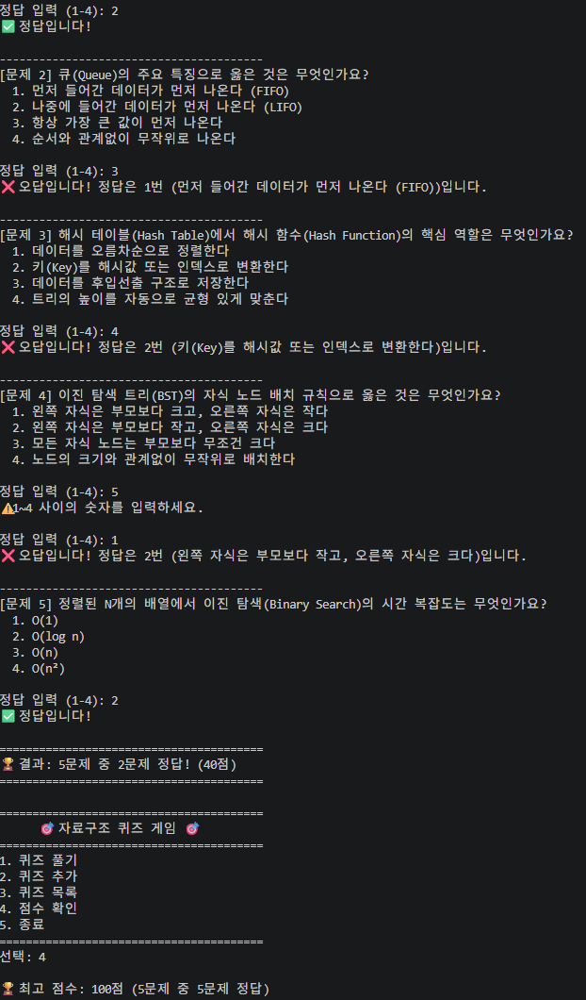
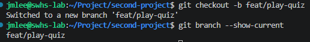
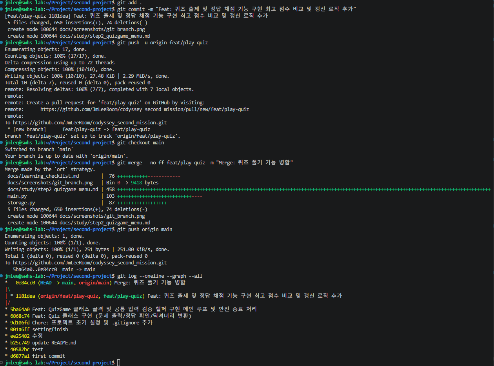
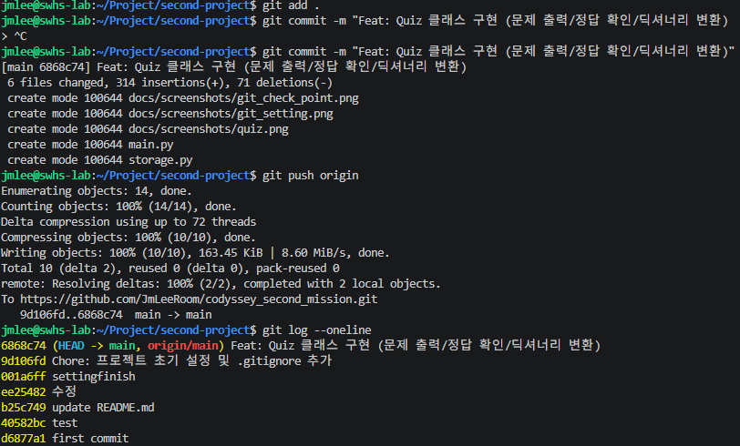
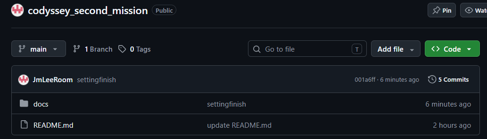
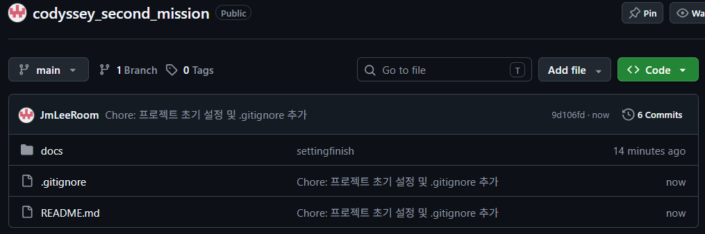
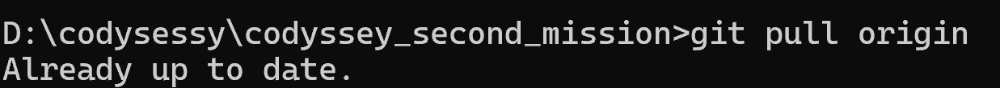

# 🎯 자료구조 퀴즈 게임

> Python 3.10+로 실행되는 터미널 기반 4지선다 퀴즈 게임입니다.
> 자료구조 문제를 풀고, 힌트를 사용하며, 퀴즈 추가·삭제와 최고 기록·최근 게임 기록 조회를 할 수 있습니다.
> 퀴즈와 점수 데이터는 JSON 파일에 저장되어 프로그램을 다시 실행해도 유지됩니다.

## 1. 프로젝트 개요

이 프로젝트는 실제로 동작하는 프로그램을 만들며 Python의 핵심 요소를 함께 연습하는 것을 목표로 합니다.

이 프로젝트의 학습 목표는 다음과 같습니다.

- **Python 기본 문법**: 입력·출력, 조건문·반복문, 함수와 입력 검증을 실제 프로그램 흐름에 적용합니다.
- **객체 지향 프로그래밍(OOP)**: <code>Quiz</code>와 <code>QuizGame</code> 클래스로 데이터와 게임 흐름의 책임을 분리합니다.
- **JSON 영속성**: <code>state.json</code>에 퀴즈·점수·히스토리를 저장하고, 파일 손상 시 기본 데이터로 안전하게 복구합니다.
- **Git 워크플로우**: 기능 단위 커밋, 브랜치 작업, clone·pull 실습으로 변경 이력을 관리합니다.

## 2. 퀴즈 주제와 선정 이유

### 주제: **자료구조(Data Structure)**

자료구조를 주제로 선택한 이유는 다음과 같습니다.

1. **정답의 명확성**: 스택의 LIFO, 큐의 FIFO처럼 객관적으로 확인 가능한 답이 있어 4지선다 문제에 적합합니다.
2. **구현과의 연결성**: 퀴즈 목록은 <code>list</code>로 관리하고, 저장·복원 데이터는 <code>dict</code>와 JSON으로 다뤄 학습 주제와 실제 구현이 연결됩니다.
3. **CS 기초 지식 가치**: 스택, 큐, 해시 테이블, 트리, 탐색 복잡도는 언어나 프레임워크가 바뀌어도 계속 활용되는 핵심 지식입니다.

### 기본 제공 퀴즈

<code>get_default_quizzes()</code>는 자료구조 기본 퀴즈 5개를 제공합니다. 각 퀴즈는 문제, 정확히 4개의 선택지, 1~4 범위의 정답 번호를 가지며 <code>Quiz</code> 생성자가 이 규칙을 검증합니다.

| 번호 | 문제 | 선택지 | 정답 |
| --- | --- | --- | --- |
| 1 | 스택(Stack)의 주요 자료 처리 방식은 무엇인가요? | 1. FIFO (선입선출) 2. LIFO (후입선출) 3. LILO (후입후출) 4. 무작위 접근 | 2 |
| 2 | 큐(Queue)의 주요 특징으로 옳은 것은 무엇인가요? | 1. 먼저 들어간 데이터가 먼저 나온다 (FIFO) 2. 나중에 들어간 데이터가 먼저 나온다 (LIFO) 3. 항상 가장 큰 값이 먼저 나온다 4. 순서와 관계없이 무작위로 나온다 | 1 |
| 3 | 해시 테이블(Hash Table)에서 해시 함수(Hash Function)의 핵심 역할은 무엇인가요? | 1. 데이터를 오름차순으로 정렬한다 2. 키(Key)를 해시값 또는 인덱스로 변환한다 3. 데이터를 후입선출 구조로 저장한다 4. 트리의 높이를 자동으로 균형 있게 맞춘다 | 2 |
| 4 | 이진 탐색 트리(BST)의 자식 노드 배치 규칙으로 옳은 것은 무엇인가요? | 1. 왼쪽 자식은 부모보다 크고, 오른쪽 자식은 작다 2. 왼쪽 자식은 부모보다 작고, 오른쪽 자식은 크다 3. 모든 자식 노드는 부모보다 무조건 크다 4. 노드의 크기와 관계없이 무작위로 배치한다 | 2 |
| 5 | 정렬된 N개의 배열에서 이진 탐색(Binary Search)의 시간 복잡도는 무엇인가요? | 1. O(1) 2. O(log n) 3. O(n) 4. O(n²) | 2 |

> 기본 제공 퀴즈 5개가 각각 4개의 선택지와 1~4 정답 번호 규칙을 통과한 터미널 검증 기록입니다.

## 3. 실행 방법

### 요구 환경

- Python 3.10 이상
- Git
- 외부 패키지 설치 없음 — Python 표준 라이브러리만 사용

터미널에서 다음 명령을 순서대로 실행합니다. 포크한 저장소를 사용한다면 첫 번째 명령의 URL만 자신의 저장소 주소로 바꾸면 됩니다.

~~~bash
# 저장소 복제
git clone https://github.com/JmLeeRoom/codyssey_second_mission.git

# 프로젝트 폴더로 이동
cd codyssey_second_mission

# 프로그램 실행
python main.py
~~~

macOS 또는 Linux 환경에서 <code>python</code> 명령이 Python 3을 가리키지 않거나 명령을 찾을 수 없으면 <code>python3 main.py</code>를 사용합니다.

> 현재 <code>main.py</code>, <code>quiz.py</code>, <code>storage.py</code>가 존재하며 메뉴 1~6과 JSON 저장·복구 기능이 구현되어 있어 위 명령으로 실행할 수 있습니다.

## 4. 기능 목록

프로그램은 아래 6개 메뉴를 제공합니다.

| 메뉴 | 기능 | 기대 동작 |
| --- | --- | --- |
| 1. 퀴즈 풀기 | 선택한 수의 저장된 퀴즈를 무작위로 출제합니다. | 정답·오답과 정답 해설을 보여 주고, 획득 점수를 선택한 문제 수로 나눠 100점 만점으로 환산합니다. 최고 점수와 비교해 갱신하며, 퀴즈가 없으면 안내 후 메뉴로 돌아갑니다. |
| 2. 퀴즈 추가 | 문제, 선택지 4개, 정답 번호와 선택적 힌트를 입력받습니다. | 공백 입력과 1~4 범위를 벗어난 정답을 재입력받아 검증하고, 성공 시 즉시 <code>state.json</code>에 저장합니다. |
| 3. 퀴즈 목록 | 등록된 모든 퀴즈를 조회합니다. | 퀴즈 번호와 문제를 표시하며, 등록된 퀴즈가 없으면 빈 목록 안내를 표시합니다. |
| 4. 점수 확인 | 최고 기록과 최근 게임 기록을 조회합니다. | 최고 점수·정답 수·전체 문제 수를 별도로 보여 주고, 아직 게임 기록이 없으면 미기록 상태를 안내합니다. 완료한 게임은 최신순 최근 5회까지 표시합니다. |
| 5. 퀴즈 삭제 | 번호로 선택한 퀴즈를 삭제합니다. | 목록을 확인하고 <code>y/n</code> 재확인 후 즉시 저장합니다. |
| 6. 종료 | 프로그램을 안전하게 마칩니다. | 현재 상태를 저장한 뒤 종료 메시지를 출력하며, <code>Ctrl+C</code>·<code>EOF</code>에도 가능한 범위에서 저장을 시도합니다. |

### 점수 계산

모든 문제를 푼 뒤 <code>획득 점수 / 전체 문제 수 × 100</code>으로 점수를 계산합니다. 힌트 없이 맞히면 1점, 힌트를 요청한 뒤 맞히면 0.5점을 얻습니다. 새 점수가 기존 최고 점수보다 높으면 최고 점수와 정답 수, 전체 문제 수를 함께 갱신하며, 점수와 관계없이 완료한 모든 게임은 히스토리에 남깁니다.

### 랜덤 출제

퀴즈 풀기에서는 저장된 목록의 얕은 복사본을 <code>random.shuffle()</code>로 섞어 무작위 순서로 출제합니다. 원본 <code>self.quizzes</code>의 순서는 유지되므로 퀴즈 목록 조회와 저장 데이터의 순서는 바뀌지 않습니다.

### 문제 수 선택

퀴즈를 시작하기 전에 1~현재 등록 퀴즈 수 범위에서 풀 문제 수를 입력합니다. 섞은 출제용 복사본에서 선택한 수만큼만 출제하며, 결과 점수와 최고 기록의 전체 문제 수도 이 선택 수를 기준으로 계산합니다.

### 힌트

문제를 푸는 중 <code>0</code>을 입력하면 등록된 힌트를 보여 준 뒤 다시 답을 입력받습니다. 힌트를 요청한 문제를 맞히면 1점 대신 0.5점만 인정하며, 최종 점수는 획득 점수 ÷ 선택한 문제 수 × 100으로 계산합니다. 새 퀴즈에는 선택적으로 힌트를 입력할 수 있습니다.

### 점수 히스토리

게임을 끝낼 때마다 날짜·시간, 푼 문제 수, 정답 수, 최종 점수를 <code>history</code>에 추가해 저장합니다. 최고 기록은 가장 높은 점수 한 건을 보여 주는 용도이고, 점수 히스토리는 모든 완료 게임을 보존하는 용도이며 점수 확인 화면에서는 최신 5회를 표시합니다.

### 입력 및 예외 처리 기준

| 상황 | 처리 기준 |
| --- | --- |
| 앞뒤 공백 입력 | <code>strip()</code>으로 공백을 제거한 뒤 처리합니다. 예: <code>  1  </code> → 1 |
| 빈 입력 | 경고 문구를 보여 주고 같은 입력 단계에서 다시 받습니다. |
| 숫자가 아닌 입력 | <code>abc</code>, <code>1.5</code> 등은 안내 후 재입력받습니다. |
| 허용 범위 밖 숫자 | 메뉴의 0·9, 정답 번호의 5 이상 등은 범위를 안내하고 재입력받습니다. (정답 입력 중 0은 범위 오류가 아니라 힌트 요청으로 별도 처리됩니다) |
| Ctrl+C 또는 EOF | <code>KeyboardInterrupt</code>, <code>EOFError</code>를 잡아 트레이스백 없이 저장 가능한 상태를 저장하고 안전 종료합니다. |
| 데이터 파일 없음·손상 | 기본 퀴즈 데이터로 실행을 계속하고, 손상 시 복구 안내를 표시합니다. |

## 5. 파일 구조와 클래스 설계

### 프로젝트 디렉터리 구조

현재 저장소의 파일 구조는 다음과 같습니다. <code>state.json</code>은 실행 중 생성·갱신되는 파일이며 Git 추적 대상이 아닙니다.

~~~text
codyssey_second_mission/
├── .gitignore               # 동적 데이터·캐시·개발 환경 파일 제외
├── main.py                  # 진입점, QuizGame, 메뉴와 안전 종료 처리
├── quiz.py                  # Quiz 모델과 기본 퀴즈 데이터
├── storage.py               # state.json 저장·로드·백업·복구
├── state.json               # [동적 생성·Git 제외] 퀴즈·점수·히스토리 데이터
├── README.md                 # 프로젝트 안내 문서
└── docs/
    ├── learning_checklist.md        # 학습·구현·제출 체크리스트
    ├── learning_guide.md             # 단계별 학습 가이드
    ├── readme_requirements_list.md   # README 작성 요구사항
    ├── reference.md                  # 과제 참고 명세
    ├── screenshots/                  # 터미널·Git 실행 증빙 이미지
    └── study/                        # 단계별 학습 노트·자가 점검
        ├── step0_dev_environment_git_init.md
        ├── step1_quiz_model.md
        ├── step2_quizgame_menu.md
        ├── step3_play_quiz_branch.md
        ├── step4_add_list_score.md
        ├── step5_state_persistence.md
        ├── step6_clone_pull.md
        ├── step7_bonus_features.md
        ├── step8_python_basics_self_check.md
        ├── step9_oop_self_check.md
        ├── step10_file_io_json_self_check.md
        └── step11_git_github_self_check.md
~~~

### 추가 예정 구조

<code>quiz_game.py</code>는 현재 존재하지 않습니다. 현재 <code>QuizGame</code> 클래스는 <code>main.py</code>에 있으며, 필요해질 때만 다음과 같이 별도 모듈로 분리할 수 있습니다.

~~~text
quiz_game.py  # [추가 예정] QuizGame의 게임 흐름과 입력 검증을 분리할 모듈
~~~

### 주요 파일과 클래스 역할

| 파일 또는 클래스 | 구분 | 책임 |
| --- | --- | --- |
| <code>main.py</code> | 실행·게임 흐름 | <code>main()</code>이 프로그램을 시작하고 <code>QuizGame</code>이 메뉴와 게임 흐름을 관리합니다. <code>KeyboardInterrupt</code>·<code>EOFError</code>가 발생하면 가능한 범위에서 저장한 뒤 안전하게 종료합니다. |
| <code>QuizGame</code> (<code>main.py</code>) | 게임 제어 클래스 | 퀴즈 풀기·추가·목록·점수·삭제를 조합하고, 메뉴 루프와 <code>ask_int()</code>·<code>ask_text()</code>·<code>ask_yes_no()</code> 입력 검증을 담당합니다. |
| <code>quiz.py</code> / <code>Quiz</code> | 퀴즈 모델 | 질문, 선택지 4개, 정답 번호, 선택적 힌트를 표현합니다. 문제 출력·정답 판정과 <code>to_dict()</code>·<code>from_dict()</code> JSON 변환을 담당합니다. |
| <code>quiz_game.py</code> | 추가 예정 모듈 | 현재는 존재하지 않습니다. 나중에 <code>QuizGame</code>을 <code>main.py</code>에서 분리할 때 게임 흐름과 입력 검증을 맡길 수 있습니다. |
| <code>storage.py</code> | 상태 저장 모듈 | <code>Path(__file__)</code> 기준으로 <code>state.json</code> 경로를 계산하고, JSON 저장·불러오기, <code>.bak</code> 백업, 손상 데이터의 기본값 복구를 담당합니다. |
| <code>state.json</code> | 동적 데이터 | 퀴즈 목록, 최고 점수, 완료된 게임 히스토리를 UTF-8 JSON으로 저장합니다. 실행 중 바뀌므로 Git에서 제외합니다. |
| <code>.gitignore</code> | Git 설정 | <code>state.json</code>, <code>state.json.bak</code>, <code>__pycache__</code>, 가상환경·에디터 설정 등 동적으로 생성되는 파일을 추적에서 제외합니다. |
| <code>docs/</code> | 문서 디렉터리 | <code>learning_checklist.md</code>, 학습 가이드·노트, 요구사항, 참고 자료와 실행 증빙 이미지를 보관합니다. |

## 6. 데이터 파일: state.json

### 경로와 인코딩

- 역할: <code>state.json</code>은 퀴즈 목록, 최고 기록, 게임 히스토리를 보존하는 실행 데이터 파일입니다.
- 경로 계산: <code>STATE_FILE = Path(__file__).resolve().parent / "state.json"</code>
- 실행 위치 독립성: 위 경로는 <code>storage.py</code>가 있는 프로젝트 루트를 기준으로 계산하므로, 터미널의 현재 작업 디렉터리(CWD)가 달라도 항상 같은 <code>state.json</code>을 읽고 씁니다.
- 인코딩: 파일을 <code>encoding="utf-8"</code>로 열어 운영체제 기본 인코딩 차이로 한글이 깨지는 문제를 막습니다.
- JSON 저장: <code>ensure_ascii=False</code>를 사용하여 한글이 <code>\uXXXX</code> 이스케이프만으로 저장되지 않고 사람이 읽을 수 있는 원문으로 남게 합니다.
- 객체 변환: 각 <code>Quiz</code> 객체의 <code>to_dict()</code> 결과만 저장하여 JSON 직렬화 오류를 방지
- 가독성: <code>indent=2</code>로 사람이 검토하기 쉬운 형식으로 저장
- 저장 실패: 권한·경로·디스크 등의 <code>OSError</code>를 안내한 뒤 프로그램을 계속 실행

저장 스키마는 다음과 같습니다.

~~~json
{
  "quizzes": [
    {
      "question": "스택(Stack)의 주요 자료 처리 방식은 무엇인가요?",
      "choices": [
        "FIFO (선입선출)",
        "LIFO (후입선출)",
        "LILO (후입후출)",
        "무작위 접근"
      ],
      "answer": 2,
      "hint": "접시를 쌓아 올린 뒤 가장 위의 접시부터 꺼내는 상황을 떠올려 보세요."
    }
  ],
  "best_score": 80,
  "best_correct": 4,
  "best_total": 5,
  "history": [
    {
      "timestamp": "2026-08-05 16:30:00",
      "total": 5,
      "correct": 4,
      "score": 80
    }
  ]
}
~~~

| 필드 | 타입 | 의미 |
| --- | --- | --- |
| <code>quizzes</code> | 배열 | 저장된 퀴즈 객체 목록 |
| <code>question</code> | 문자열 | 퀴즈 질문 |
| <code>choices</code> | 문자열 배열 | 순서가 있는 선택지 4개 |
| <code>answer</code> | 정수 | 정답 선택지 번호(1~4) |
| <code>hint</code> | 문자열 또는 null | 선택적 힌트. 이전 저장 파일에 없으면 <code>null</code>로 복원 |
| <code>best_score</code> | 정수 | 현재 최고 점수(100점 만점) |
| <code>best_correct</code> | 정수 | 최고 기록의 정답 수 |
| <code>best_total</code> | 정수 | 최고 기록에서 푼 전체 문제 수 |
| <code>history</code> | 객체 배열 | 완료한 모든 게임의 기록. 이전 저장 파일에 없으면 빈 배열로 복원 |
| <code>history[].timestamp</code> | 문자열 | 게임을 마친 날짜와 시간 |
| <code>history[].total</code> | 정수 | 해당 게임에서 푼 문제 수 |
| <code>history[].correct</code> | 정수 | 해당 게임에서 맞힌 문제 수 |
| <code>history[].score</code> | 정수 | 힌트 감점이 반영된 해당 게임의 최종 점수 |

모든 <code>quizzes</code> 항목은 <code>question</code>, <code>choices</code>, <code>answer</code>를 가져야 합니다. <code>choices</code>는 정확히 4개의 문자열로 구성되고, <code>answer</code>는 사용자가 보는 번호와 같은 1~4 범위의 정수입니다.

### 첫 실행과 복구 동작

현재 동작은 다음과 같습니다.

1. **정상 로드**: 퀴즈 객체, 최고 기록, 게임 히스토리를 복원한 뒤 퀴즈 개수와 최고 점수를 안내합니다. 이전 형식에 없는 점수 필드와 <code>history</code>는 각각 <code>0</code>, 빈 배열로 보완합니다.
2. **첫 실행 — <code>FileNotFoundError</code>**: 파일이 없으면 오류로 끝내지 않고, 코드에 포함한 기본 퀴즈 5개 이상과 초기 점수로 <code>state.json</code>을 생성한 뒤 시작합니다.
3. **손상·구조 오류**: <code>json.JSONDecodeError</code>, <code>UnicodeDecodeError</code>, <code>KeyError</code>, <code>TypeError</code>, <code>ValueError</code>가 발생하면 원인을 안내합니다. 가능한 경우 기존 파일을 <code>state.json.bak</code>으로 백업한 뒤 기본 퀴즈와 점수 <code>0</code>으로 복구하므로 트레이스백으로 종료하지 않습니다. 백업 자체가 실패해도 복구는 계속합니다.
4. **읽기·권한 오류 — <code>OSError</code>**: 파일을 읽을 수 없으면 안내를 출력하고 메모리의 기본 데이터로 실행을 계속합니다.

### 저장·로드 호출 시점

- <code>QuizGame</code> 생성 직후 <code>load_state()</code>를 호출해 이전 상태를 복원합니다.
- 퀴즈 추가·삭제와 매 게임 완료 직후, 메뉴 6번의 정상 종료 직전에 <code>save_state()</code>를 호출합니다.
- <code>Ctrl+C</code>와 <code>EOF</code> 종료도 <code>_save_before_exit()</code>를 거쳐 저장을 시도합니다.

### Git 추적 방침

실행 중 계속 바뀌는 <code>state.json</code>과 <code>state.json.bak</code>는 <code>.gitignore</code>에 넣습니다. 개인 퀴즈·점수·테스트 기록 때문에 Git 변경 이력이 불필요하게 늘어나는 것을 막고, 파일이 없는 첫 실행 및 손상 파일 복구를 깨끗한 상태에서 검증할 수 있기 때문입니다.

현재 저장소는 이 방침을 적용해 <code>state.json</code>과 <code>state.json.bak</code>를 <code>.gitignore</code>로 추적 제외합니다.

## 7. 화면 및 제출 증빙

### 개발 환경 설정

Python 3.12.3, Git 2.43.0, Git 전역 사용자 설정을 확인한 실제 터미널 화면입니다.

### 실제 퀴즈·Git 증빙

현재 존재하는 파일만 연결했습니다. <code>step4.png</code>는 삭제 기능을 추가하기 전의 1~5 메뉴 캡처이므로, 퀴즈 풀이·입력 검증·점수 출력의 **과거 실행 증빙**으로만 사용합니다. 현재 1~6 메뉴 전체 화면은 새로 촬영할 예정입니다.

> 로컬 커밋(<code>git commit</code>)부터 원격 push(<code>git push</code>), 이후 <code>git log --oneline</code> 확인까지 이어지는 실제 터미널 기록입니다.

> 저장소 이름 옆의 **Public** 배지로 이 GitHub 저장소가 비공개가 아닌 공개 상태임을 확인할 수 있습니다.

### 증빙 파일 매핑 현황

존재하지 않는 <code>menu.png</code>, <code>play.png</code>, <code>add_quiz.png</code>, <code>score.png</code>, <code>git_graph.png</code>는 이미지로 미리 연결하지 않았습니다.

| 분류 | 증빙 내용 | 실제 파일 | 상태 |
| --- | --- | --- | --- |
| 환경 | Python·Git 버전과 전역 Git 설정 | <code>docs/screenshots/env_setup.png</code> | 연결됨 |
| 기본 퀴즈 모델 | 기본 퀴즈 5개, 선택지·정답 검증 | <code>docs/screenshots/quiz.png</code> | [퀴즈 주제 섹션](#2-퀴즈-주제와-선정-이유)에 연결됨 |
| 퀴즈 풀이·점수 | 정답·오답, 범위 재입력, 결과, 최고 점수 | <code>docs/screenshots/step4.png</code> | 과거 실행 증빙 연결됨 |
| 현재 1~6 메뉴 | 데이터 로드 안내와 삭제 기능을 포함한 메뉴 | 없음 | 촬영 후 연결 예정 |
| 퀴즈 추가 | 문제·선택지 4개·정답 입력과 저장 성공 | 없음 | 촬영 후 연결 예정 |
| 점수 확인 | 현재 최고 기록·최근 히스토리 또는 미기록 상태 | 없음 | 촬영 후 연결 예정 |
| Git 브랜치·병합 | <code>feat/play-quiz</code> 브랜치와 <code>--no-ff</code> 병합 | <code>docs/screenshots/git_branch.png</code>, <code>docs/screenshots/step3.png</code> | 연결됨 |
| Git 커밋·push | 커밋, 원격 push, <code>git log --oneline</code> 이력 | <code>docs/screenshots/step1_git.png</code> | 연결됨 |
| GitHub 체크포인트·Public 상태 | 원격 저장소의 초기 체크포인트와 Public 공개 배지 | <code>docs/screenshots/git_setting.png</code>, <code>docs/screenshots/git_check_point.png</code> | 연결됨 |

## 8. Git 워크플로우 검증 계획

제출 전에는 아래 항목을 실제 저장소 이력과 캡처로 확인합니다.

- <code>init</code>, <code>add</code>, <code>commit</code>, <code>push</code>, <code>pull</code>, <code>checkout</code>, <code>clone</code> 명령을 각각 최소 한 번 사용합니다.
- 메뉴, Quiz 모델, 기본 데이터, 퀴즈 풀기, 퀴즈 추가, 목록, 점수, 파일 입출력, README 등 기능 단위로 의미 있는 커밋을 10개 이상 남깁니다.
- <code>feat/play-quiz</code> 같은 기능 브랜치에서 작업하고 <code>--no-ff</code> 병합 이력을 남깁니다.
- 별도 디렉터리에 저장소를 복제해 간단한 변경을 push한 뒤, 원래 작업 디렉터리에서 <code>pull</code>로 반영되는 것을 확인합니다.
- GitHub 저장소가 로그인하지 않은 사용자도 접근할 수 있는 **Public** 상태인지 확인합니다 (<code>docs/screenshots/git_setting.png</code>, <code>docs/screenshots/git_check_point.png</code>의 Public 배지로 확인).

권장 커밋 메시지 형식은 다음과 같습니다.

~~~text
Feat: 퀴즈 출제 기능 구현
Fix: 점수 계산 오류 수정
Docs: README 실행 방법 추가
Refactor: QuizGame 책임 분리
Chore: Git ignore 규칙 추가
~~~

검증 시점에는 `git log --oneline`에서 15개 커밋을 확인했고, `feat/play-quiz` 브랜치의 `--no-ff` 병합 커밋(`0e84cc0`)과 `quiz-clone`에서 만든 회고 커밋을 원본으로 `pull`한 이력도 확인했습니다. 다만 초기 이력에는 `test`, `수정`처럼 설명이 부족한 메시지가 남아 있으므로, 이후 커밋은 위 형식처럼 변경 내용을 분명히 적는 방침을 유지합니다.

## 9. 구현 완료 전 점검표

- [x] Python 3.10 이상에서 <code>python main.py</code>가 외부 패키지 없이 실행된다.
- [x] 자료구조 기본 퀴즈 5개 이상이 문제·선택지 4개·정답 번호와 함께 제공된다.
- [x] 메뉴 6종과 빈 퀴즈·미기록·빈 삭제 목록 상태가 모두 처리된다.
- [x] 공백, 빈 입력, 숫자 변환 실패, 범위 밖 입력, Ctrl+C, EOF를 안전하게 처리한다.
- [x] <code>state.json</code>에 UTF-8로 저장하고 파일 없음·손상 상태에서 복구한다.
- [x] <code>Quiz</code>, <code>QuizGame</code>을 포함해 책임이 분리된 클래스 구조를 갖춘다.
- [ ] 실행 화면과 Git 그래프 증빙을 추가한다. (환경·기본 퀴즈·과거 실행·브랜치 병합·커밋 이력·Public 상태 캡처는 연결 완료. 현재 1~6 메뉴·퀴즈 추가·점수 확인 전용 캡처는 촬영 예정)
- [x] 의미 있는 커밋 10개 이상과 기능 브랜치 병합 이력이 있다.

## 참고 문서

- [README 작성 요구사항](docs/readme_requirements_list.md)
- [학습 가이드](docs/learning_guide.md)
- [원본 과제 명세](docs/reference.md)

## 학습 회고

`Path(__file__).resolve().parent`로 저장 경로를 계산해 실행 위치가 달라도 같은 `state.json`을 사용하도록 구현하며 상대 경로의 위험성을 배웠습니다. 또한 JSON 문법 오류나 필수 키 누락 시 파일을 `.bak`으로 백업하고 기본 데이터로 복구하는 흐름을 만들며, 예외 처리와 데이터 복구의 중요성을 경험했습니다.

# 대규모 JSON 데이터 처리 시 주요 문제점 🚨

대규모 JSON 데이터를 처리할 때 발생할 수 있는 주요 문제점과 그 해결책을 요약한 내용입니다.

| 주요 문제점 | 원인 | 해결 방법 |
| --- | --- | --- |
| **1. 메모리 부족** | `json.load()`로 대용량 파일 전체를 한 번에 메모리에 적재 | **JSON Lines(.jsonl) 또는 스트리밍 파서(ijson)**를 사용하여 한 번에 한 줄/객체씩 처리 |
| **2. 검색 속도 저하** | 리스트 구조에서 특정 데이터를 순차 탐색 (O(n)) | 고유 식별자(ID 등)를 키로 하는 **딕셔너리 인덱스**를 생성하여 검색 속도 최적화 (O(1)) |
| **3. 중첩 구조 접근 오류** | 깊은 계층 구조에서 중간 키가 누락될 경우 `KeyError` 발생 | `.get()` 메서드를 활용하거나, **안전한 중첩 접근 함수(Nested Get)**를 만들어 기본값 반환 |
| **4. 데이터 누락 및 타입 오류** | 데이터 누락, `null` 값, 잘못된 타입 입력 등 데이터 오염 | `.get(key, default)` 사용 및 `isinstance()`를 통한 **엄격한 데이터 타입 검증** 적용 |
| **5. 파일 부분 손상 (JSON 파싱 오류)** | 데이터 중 일부에만 JSON 문법 오류가 있어도 전체 실행이 중단됨 | 개별 파싱 단계에서 `try-except json.JSONDecodeError`를 적용해 **오류를 격리**하고 건너뛰기 |

> **핵심 요약:** 대규모 JSON 파일은 단순 로딩을 넘어, **스트리밍 처리(메모리), 인덱싱(속도), 방어적 프로그래밍(예외 및 검증)**을 함께 고려해 다뤄야 합니다.
