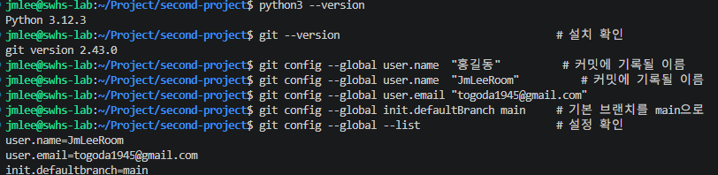

# 🎯 자료구조 퀴즈 게임

> Python 기초, 객체 지향 프로그래밍(OOP), JSON 파일 입출력, Git 워크플로우를 함께 익히기 위한 터미널 기반 4지선다 퀴즈 게임 프로젝트입니다.

## 문서 상태

이 README는 [문서 요구사항](docs/readme_requirements_list.md)을 바탕으로 작성한 프로젝트 안내 및 구현 명세입니다. 현재 저장소에는 실행 소스와 실행 화면 캡처가 아직 추가되지 않았습니다. 따라서 아래의 기능, 파일 구조, 데이터 복구 동작은 **구현 목표**로 표기하며, 완료 후 실제 동작과 스크린샷으로 검증해야 합니다.

## 1. 프로젝트 개요

자료구조를 주제로 한 콘솔 4지선다 퀴즈 게임을 만듭니다. 사용자는 퀴즈를 풀고, 새 문제를 등록하고, 목록과 최고 점수를 확인할 수 있습니다. 퀴즈와 최고 점수는 프로젝트 루트의 JSON 파일에 저장되어 프로그램을 다시 실행해도 유지됩니다.

이 프로젝트의 학습 목표는 다음과 같습니다.

- Python 기본 문법과 입력·출력, 조건문·반복문을 실제 프로그램 흐름에 적용합니다.
- <code>Quiz</code>, <code>QuizGame</code> 클래스로 역할을 분리해 객체 지향 설계를 연습합니다.
- JSON 파일을 이용해 데이터를 저장·복구하고 예외를 안전하게 처리합니다.
- 기능 단위 커밋과 브랜치 병합으로 Git/GitHub 작업 흐름을 기록합니다.

## 2. 퀴즈 주제와 선정 이유

### 주제: 자료구조 (Data Structure)

자료구조를 선택한 이유는 다음과 같습니다.

1. 스택의 LIFO, 큐의 FIFO처럼 정답이 명확해 객관적인 4지선다 문제를 만들기 좋습니다.
2. 게임 내부에서도 퀴즈 목록은 <code>list</code>, 저장 데이터는 <code>dict</code>와 JSON으로 다루므로 학습 주제와 구현이 자연스럽게 연결됩니다.
3. 스택, 큐, 해시 테이블, 탐색 복잡도는 언어가 바뀌어도 계속 쓰이는 기초 컴퓨터 과학 지식입니다.

### 기본 제공 퀴즈 계획

구현 시 아래 5개 이상의 퀴즈를 기본 데이터로 포함합니다. 모든 문제는 선택지 4개와 정답 번호 1~4를 가집니다.

| 번호 | 문제 | 선택지 | 정답 |
| --- | --- | --- | --- |
| 1 | 스택(Stack)의 자료 처리 방식은 무엇인가요? | 1. FIFO / 2. LIFO / 3. 무작위 접근 / 4. 우선순위 순 | 2 |
| 2 | 큐(Queue)의 자료 처리 방식은 무엇인가요? | 1. FIFO / 2. LIFO / 3. 이진 탐색 / 4. 재귀 호출 | 1 |
| 3 | 너비 우선 탐색(BFS)에서 주로 사용하는 자료구조는 무엇인가요? | 1. 스택 / 2. 큐 / 3. 힙 / 4. 트리 | 2 |
| 4 | 정렬된 배열에서 이진 탐색의 시간 복잡도는 무엇인가요? | 1. O(1) / 2. O(log n) / 3. O(n) / 4. O(n²) | 2 |
| 5 | 해시 테이블의 평균적인 키 탐색 시간 복잡도는 무엇인가요? | 1. O(n) / 2. O(log n) / 3. O(1) / 4. O(n²) | 3 |

## 3. 실행 방법

### 요구 환경

- Python 3.10 이상
- Git
- 외부 패키지 설치 없음 — Python 표준 라이브러리만 사용

다음 명령으로 실행합니다.

~~~bash
git clone https://github.com/JmLeeRoom/codyssey_second_mission.git
cd codyssey_second_mission
python main.py
~~~

macOS 또는 Linux 환경에서 <code>python</code> 명령이 Python 3을 가리키지 않으면 <code>python3 main.py</code>를 사용합니다.

> 현재 <code>main.py</code>, <code>quiz.py</code>, <code>storage.py</code>가 있으며, 메뉴 골격과 공통 입력 검증을 실행할 수 있습니다. 메뉴 1~4의 세부 기능은 이후 단계에서 구현합니다.

## 4. 기능 목록

프로그램은 아래 5개 메뉴를 제공합니다.

| 메뉴 | 기능 | 기대 동작 |
| --- | --- | --- |
| 1. 퀴즈 풀기 | 저장된 퀴즈를 순서대로 출제합니다. | 정답·오답과 해설을 보여 주고, 전체 종료 후 100점 만점 점수와 최고 점수 갱신 여부를 안내합니다. 퀴즈가 없으면 안내 후 메뉴로 돌아갑니다. |
| 2. 퀴즈 추가 | 문제, 선택지 4개, 정답 번호를 입력받습니다. | 빈 텍스트와 1~4 밖의 정답 번호를 다시 입력받고, 성공 시 즉시 <code>state.json</code>에 저장합니다. |
| 3. 퀴즈 목록 | 등록된 모든 퀴즈를 조회합니다. | 번호와 문제를 표시하며, 퀴즈가 없으면 별도 안내를 표시합니다. |
| 4. 점수 확인 | 최고 기록을 조회합니다. | 아직 푼 기록이 없으면 미기록 상태를, 기록이 있으면 최고 점수와 정답 수를 표시합니다. |
| 5. 종료 | 프로그램을 안전하게 마칩니다. | 현재 상태를 저장할 수 있는 범위에서 저장한 뒤 종료 메시지를 출력합니다. |

### 점수 계산

모든 문제를 푼 뒤 <code>정답 수 / 전체 문제 수 × 100</code>으로 점수를 계산합니다. 새 점수가 기존 최고 점수보다 높으면 최고 점수와 정답 수, 전체 문제 수를 함께 갱신합니다.

### 입력 및 예외 처리 기준

| 상황 | 처리 기준 |
| --- | --- |
| 앞뒤 공백 입력 | <code>strip()</code>으로 공백을 제거한 뒤 처리합니다. 예: <code>  1  </code> → 1 |
| 빈 입력 | 경고 문구를 보여 주고 같은 입력 단계에서 다시 받습니다. |
| 숫자가 아닌 입력 | <code>abc</code>, <code>1.5</code> 등은 안내 후 재입력받습니다. |
| 허용 범위 밖 숫자 | 메뉴의 0·9, 정답 번호의 0·5 등은 범위를 안내하고 재입력받습니다. |
| Ctrl+C 또는 EOF | <code>KeyboardInterrupt</code>, <code>EOFError</code>를 잡아 트레이스백 없이 저장 가능한 상태를 저장하고 안전 종료합니다. |
| 데이터 파일 없음·손상 | 기본 퀴즈 데이터로 실행을 계속하고, 손상 시 복구 안내를 표시합니다. |

## 5. 파일 구조와 클래스 설계

### 현재 문서 파일

현재 저장소에 있는 문서 자산은 다음과 같습니다.

~~~text
codyssey_second_mission/
├── README.md
└── docs/
    ├── image.png
    ├── learning_guide.md
    ├── readme_requirements_list.md
    └── reference.md
~~~

### 구현 목표 파일 구조

아래 구조는 실행 프로그램을 완성할 때 추가할 목표 구조입니다. 아직 없는 파일을 이미 구현된 것처럼 의미하지 않습니다.

~~~text
codyssey_second_mission/
├── main.py                  # QuizGame 클래스, 메뉴 시작, 안전 종료 처리
├── quiz.py                  # Quiz 클래스
├── storage.py               # state.json 읽기·쓰기·복구 로직 (분리 시)
├── state.json               # 실행 중 생성되는 퀴즈·점수 데이터
├── .gitignore               # 동적 데이터와 개발 환경 파일 제외
├── README.md
└── docs/
    ├── image.png            # 현재 보유한 개발 환경 설정 캡처
    ├── learning_guide.md
    ├── readme_requirements_list.md
    ├── reference.md
    └── screenshots/         # 메뉴·플레이·추가·점수·Git 증빙 캡처
~~~

### 클래스 책임

| 클래스 또는 모듈 | 책임 |
| --- | --- |
| <code>Quiz</code> | 문제(<code>question</code>), 선택지 4개(<code>choices</code>), 정답 번호(<code>answer</code>)를 표현합니다. 문제 출력과 정답 확인을 담당하고, <code>to_dict()</code>·<code>from_dict()</code>로 JSON 데이터와 객체를 변환합니다. |
| <code>QuizGame</code> | 퀴즈 목록, 최고 점수, 메뉴 루프를 관리합니다. 퀴즈 풀기·추가·목록 조회·점수 확인을 조합하고, <code>ask_int()</code>·<code>ask_text()</code> 같은 공통 입력 검증을 제공합니다. |
| <code>storage.py</code> (선택 분리) | 프로젝트 루트의 데이터 경로를 정하고 JSON 저장·불러오기, 백업과 손상 복구를 담당합니다. 이 역할은 <code>QuizGame</code>에 통합할 수도 있습니다. |
| <code>main.py</code> | 게임을 생성·실행하고 메뉴 흐름을 담당합니다. <code>KeyboardInterrupt</code>·<code>EOFError</code> 발생 시 가능한 범위에서 저장한 뒤 안전하게 종료합니다. |

## 6. 데이터 파일: state.json

### 경로와 인코딩

- 경로: 프로젝트 루트의 <code>./state.json</code>
- 권장 경로 계산: <code>Path(__file__).resolve().parent / "state.json"</code>
- 인코딩: UTF-8
- JSON 저장: <code>ensure_ascii=False</code>를 사용하여 한글을 원문 그대로 저장

예상 스키마는 다음과 같습니다.

~~~json
{
  "quizzes": [
    {
      "question": "스택(Stack)의 자료 처리 방식은?",
      "choices": [
        "FIFO (선입선출)",
        "LIFO (후입선출)",
        "우선순위 순",
        "무작위 접근"
      ],
      "answer": 2
    }
  ],
  "best_score": 80,
  "best_correct": 4,
  "best_total": 5
}
~~~

| 필드 | 타입 | 의미 |
| --- | --- | --- |
| <code>quizzes</code> | 배열 | 저장된 퀴즈 객체 목록 |
| <code>question</code> | 문자열 | 퀴즈 질문 |
| <code>choices</code> | 문자열 배열 | 순서가 있는 선택지 4개 |
| <code>answer</code> | 정수 | 정답 선택지 번호(1~4) |
| <code>best_score</code> | 정수 | 현재 최고 점수(100점 만점) |
| <code>best_correct</code> | 정수 | 최고 기록의 정답 수 |
| <code>best_total</code> | 정수 | 최고 기록에서 푼 전체 문제 수 |

### 첫 실행과 복구 동작

구현 목표는 다음과 같습니다.

1. 첫 실행에 파일이 없으면 <code>FileNotFoundError</code>를 처리하고, 코드에 포함한 기본 퀴즈 5개 이상으로 시작합니다.
2. JSON 형식이 깨졌거나 필수 데이터가 잘못되면 <code>json.JSONDecodeError</code>, <code>KeyError</code>, <code>ValueError</code>, <code>OSError</code>를 처리합니다.
3. 손상된 파일은 가능한 경우 <code>state.json.bak</code>으로 백업한 뒤 기본 데이터로 안전하게 복구합니다.
4. 저장이나 읽기에 실패해도 사용자에게 원인을 안내하고 프로그램이 비정상 종료하지 않도록 합니다.

### Git 추적 방침

권장 방침은 실행 중 계속 바뀌는 <code>state.json</code>과 <code>state.json.bak</code>를 <code>.gitignore</code>에 넣는 것입니다. 이렇게 하면 개인 퀴즈·점수 변경으로 Git 이력이 불필요하게 늘어나지 않으며, 파일이 없는 첫 실행 복구도 검증할 수 있습니다.

현재 저장소는 이 방침을 적용해 <code>state.json</code>과 <code>state.json.bak</code>를 <code>.gitignore</code>로 추적 제외합니다.

## 7. 화면 및 제출 증빙

### 개발 환경 설정

현재 보유한 Python·Git 설정 화면입니다.

### 추가로 촬영할 화면

실행 기능이 추가되면 아래 파일을 실제 실행 결과로 생성하고, README에 이미지 링크를 추가합니다. 존재하지 않는 이미지를 미리 링크하지 않아 깨진 링크가 생기지 않도록 했습니다.

| 권장 파일 경로 | 증빙 내용 | 현재 상태 |
| --- | --- | --- |
| <code>docs/screenshots/env_setup.png</code> | Python 3.10+·Git 버전·Git 사용자 설정 | 기존 <code>docs/image.png</code>로 유사 증빙 보유 |
| <code>docs/screenshots/menu.png</code> | 데이터 로딩 안내와 1~5 메인 메뉴 | 실행 코드 추가 후 촬영 필요 |
| <code>docs/screenshots/play.png</code> | 문제 출제, 정오답 판정, 100점 환산, 최고 점수 갱신 | 실행 코드 추가 후 촬영 필요 |
| <code>docs/screenshots/add_quiz.png</code> | 문제·선택지·정답 입력과 저장 성공 | 실행 코드 추가 후 촬영 필요 |
| <code>docs/screenshots/score.png</code> | 최고 점수 또는 미기록 상태 | 실행 코드 추가 후 촬영 필요 |
| <code>docs/screenshots/git_graph.png</code> | <code>git log --oneline --graph --all</code> 결과 | Git 이력 보강 후 촬영 필요 |

## 8. Git 워크플로우 검증 계획

제출 전에는 아래 항목을 실제 저장소 이력과 캡처로 확인합니다.

- <code>init</code>, <code>add</code>, <code>commit</code>, <code>push</code>, <code>pull</code>, <code>checkout</code>, <code>clone</code> 명령을 각각 최소 한 번 사용합니다.
- 메뉴, Quiz 모델, 기본 데이터, 퀴즈 풀기, 퀴즈 추가, 목록, 점수, 파일 입출력, README 등 기능 단위로 의미 있는 커밋을 10개 이상 남깁니다.
- <code>feat/play-quiz</code> 같은 기능 브랜치에서 작업하고 <code>--no-ff</code> 병합 이력을 남깁니다.
- 별도 디렉터리에 저장소를 복제해 간단한 변경을 push한 뒤, 원래 작업 디렉터리에서 <code>pull</code>로 반영되는 것을 확인합니다.

권장 커밋 메시지 형식은 다음과 같습니다.

~~~text
Feat: 퀴즈 출제 기능 구현
Fix: 점수 계산 오류 수정
Docs: README 실행 방법 추가
Refactor: QuizGame 책임 분리
Chore: Git ignore 규칙 추가
~~~

현재 Git 이력은 이 요구사항을 아직 충족하지 않는 문서 작성 단계이므로, 구현 과정에서 실제 커밋과 병합으로 증빙을 보완해야 합니다.

## 9. 구현 완료 전 점검표

- [ ] Python 3.10 이상에서 <code>python main.py</code>가 외부 패키지 없이 실행된다.
- [ ] 자료구조 기본 퀴즈 5개 이상이 문제·선택지 4개·정답 번호와 함께 제공된다.
- [ ] 메뉴 5종과 빈 퀴즈·미기록 상태가 모두 처리된다.
- [ ] 공백, 빈 입력, 숫자 변환 실패, 범위 밖 입력, Ctrl+C, EOF를 안전하게 처리한다.
- [ ] <code>state.json</code>에 UTF-8로 저장하고 파일 없음·손상 상태에서 복구한다.
- [ ] <code>Quiz</code>, <code>QuizGame</code>을 포함해 책임이 분리된 클래스 구조를 갖춘다.
- [ ] 실행 화면과 Git 그래프 증빙을 추가한다.
- [ ] 의미 있는 커밋 10개 이상과 기능 브랜치 병합 이력이 있다.

## 참고 문서

- [README 작성 요구사항](docs/readme_requirements_list.md)
- [학습 가이드](docs/learning_guide.md)
- [원본 과제 명세](docs/reference.md)
